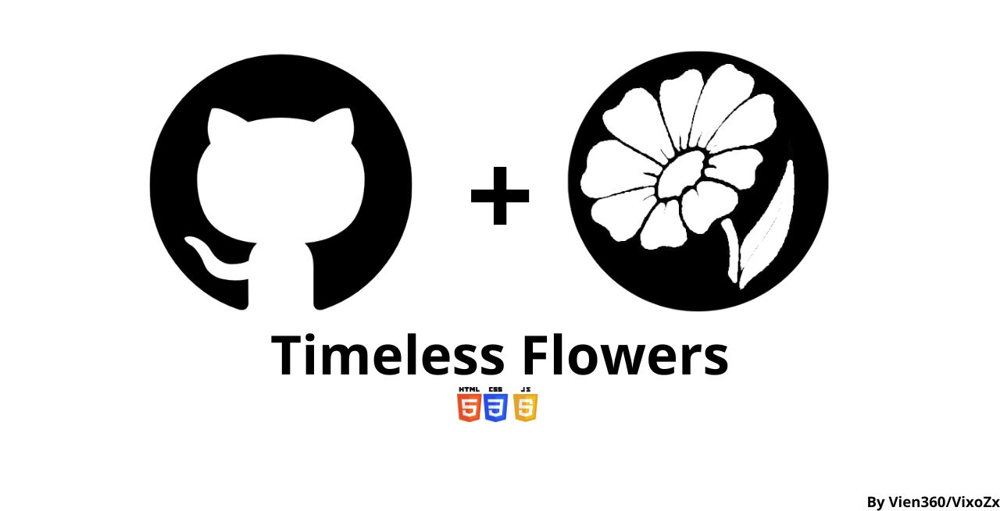

# TimelessFlowers 🌼

## Table of Contents :
* [![][IntroductionImage]][IntroductionLink]
* [![][ProcessImage]][ProcessLink]
* [![][CreditsImage]][CreditsLink] 
* [![][LicenseImage]][LicenseLink]
  

## Introduction:
### What is this repository/Project?:
<h4>This repository/project is an anniversary gift for my girlfriend, as well as being a way to test my knowledge. I wanted to implement all my knowledge so that the result is as aesthetic as possible.</h4>

### Functioning 📈:
<h4>Everything starts in the index.html file, which is a login but only by guessing the password. If you can guess the password, the page redirects you to PaginaPrincipal.html"(What is the main page), where there is a carousel of videos. (Memories), and there is a button to play random music, below there is a letter with a poem that opens with a button, Also the two js files have a functionality, which if it detects that you are accessing from a phone, it redirects you to Phone.html (I would have a hard time making the 2 css and html responsive and adaptable to a phone so I implemented this function, part, below there is a link that redirects to the Spotify list where I get the music for the page. Then in the last section the rights part that confirms that I made the page (Note: there are some codes that are not 100% mine *more than anything they are css*), There is a secret button that takes you to the Google clone, where there is a search engine in which you have to guess the name of the web pages so that the Google-clone page redirects you to the one you guessed.</h4>

> [!NOTE]
> **All the codes and the page are in Spanish! (I speak Spanish), _This is my first repository and proyect_** 

## Process:

### Original idea 💡:
The original idea was born thanks to a tiktok that I saw and wanted to replicate it (My anniversary is coming up), Due credits to the creator of the tiktok [Video](https://vm.tiktok.com/ZMrmExupx/) P.S:(I didn't find the original repository)

### Technologies used in the project👨‍💻:
* 
* 
* 
* SHA-256

### Work throughout the months📅​:
1. April:
   - Planning and brainstorming, in addition to trying to represent my ideas through drawing
   - (before watching the video I was already thinking about this project)
2. May:
   - This month I started making the first prototypes to give me an idea of ​​what my planning would look like and the ideas I had thought about (To be able to approve or eliminate ideas)
3. June:
   - In this I began to test the ideas that I approved the previous month in a format that was more beautiful to look at, (this month more than anything was to test how they would look visually and start creating the visuals and audios)
4. July:
   - This month I started working on the final files, first starting with the login, then finishing the main page and finally the page in case a mobile device is detected.
5. August:
   - This month I couldn't make any progress, since I was very busy. In the last few days I was able to start the puzzle page, touch up the last details of Login.html and Main Page.html. In addition to finishing almost all the visuals, although not the audios
5. September:
   - This was the month in which I made the most progress (Because I had to finish it on time), I finished the puzzle, the secret.html page (scratch and win), the gift.html and the credits page. In addition to finishing the visuals and audios.

   ![WorkImage]

## Credits:
> All credits for the CSS, JS, among others to the following creators
*  GAGAN-GV: (PaginaPrincipal.html) by the css and html of the button in the letter [ℹ️Original Code][CreditLink1]
*  YAYA12085: (PaginaPrincipal.html) by the css and html of the button that redirects to the playlist in the penultimate section [ℹ️Original Code][CreditLink2]
*  SATYAMCHAUDHARYDEV: (index.html and Secreto.html) by the css and html of the button that is used to start the function of testing the password [ℹ️Original Code][CreditLink3]
*  ABANOUBMAGDY1: (index.html and Secreto.html) by the css and html of the input that is used to know the value of "Password" [ℹ️Original Code][CreditLink4]
*  [HUEHUETSALETH][Author]: (web_search.html)by the css and html of the Google-clone web page [ℹ️Original Repository][CreditLink5]
*  [ANDRERUFFERT][Author2]: (Secreto.html) for the JS and html that was used as a template and for a good functioning of the "minigame"  [ℹ️Original Repository][CreditLink6]
<h2>Without the code of all these programmers my project would not have turned out as good as it is now. Thank you very much to all of you ❤️.</h2>

## License
> This project is licensed under the MIT License

[MIT](https://choosealicense.com/licenses/mit/)

##
[![][BackImage]][BackLink]

<!--Links and Images Groups -->
[CreditLink1]: https://uiverse.io/gagan-gv/rotten-fish-89
[CreditLink2]: https://uiverse.io/Yaya12085/fat-pug-2
[CreditLink3]: https://uiverse.io/satyamchaudharydev/purple-rat-85
[CreditLink4]: https://uiverse.io/AbanoubMagdy1/afraid-yak-99
[CreditLink5]: https://github.com/HuehuetSaleth/Google-Clone
[CreditLink6]: https://github.com/andreruffert/scratchie.js

[Author]:https://github.com/HuehuetSaleth/
[Author2]: https://github.com/andreruffert/

[BackLink]: #readme-top
[CreditsLink]: #credits
[IntroductionLink]: #introduction
[ProcessLink]: #process
[LicenseLink]: #license

[WorkImage]: Work.gif
[BackImage]: BackToTop.gif
[CreditsImage]: CREDITS.gif
[IntroductionImage]: Introduction.gif
[ProcessImage]: Process.gif
[LicenseImage]: License.gif
